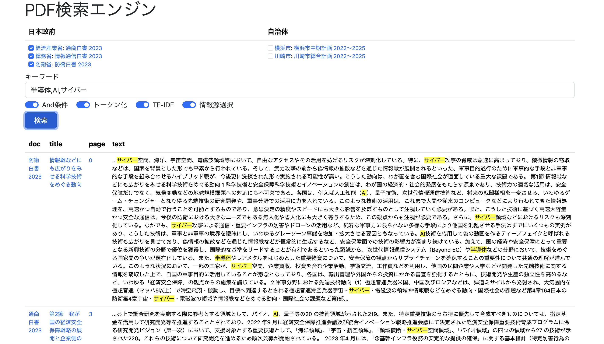

# PDF Search



Webアプリ画面(2024/05/06時点)


## 背景

2024/05/01にプロジェクト開始。社内外情報収集ツールとしてPDF検索エンジンを開発。私の趣味として開発するが、仕事での利用も想定する。

ここで開発するものは、最終的にはPyInstallerでEXEに固めて会社の同僚などへ配布可能なものとする。仕事で使う時は、Box上でデータベースやEXEを共有する形になる。

## 開発計画

- Step1: 団体や企業が公開するPDF資料（白書やIR資料など）をキーワードで検索し、ヒットしたページをキーワードハイライトしながら表示する。まずは、日本の各省庁が公開する白書から始めるが、自治体や企業が公開する中期計画資料等も含めていく。
- Step2: キーワードのランキングを生成する：Betweenness, TF-IDFなど。キーワード候補を表示する。
- Step3: ナレッジグラフを作成する。ナレッジグラフからもPDF検索。

## アーキテクチャー

O'Reillyの実践自然言語処理 7.1 情報検索を参考にアーキテクチャーを考えた。

クライアント・サーバーだけど、ローカルPC上でローカルソケットでプロセス間通信するので、実質、スタンドアロンアプリとして動作する。

検索対象となるPDF資料の合計データ量が少ないので、とりあえず、PDF資料からテキストデータをSQLiteへ保存し、SQLiteの検索機能で文章抽出する構成とした。クローラーのみでインデクサーはなし。これでも十分な応答速度が得られる。データ量が増えたら、インでクサーとして、SQLiteのVirtual Table機能活用を考える。

[アーキテクチャー図](https://docs.google.com/presentation/d/e/2PACX-1vSTcAQs16wdLKj2Ndpa6pm0MrJLDI1DcmLM6ZNvANhVn1qFPvWvD1FXRj9WBLG1m1_55C8bX7csbp_f/pub?start=false&loop=false&delayms=3000)

## 部品/フレームワーク

- Jupyter Notebook, PyMuPDF, spaCy
- SQLite3
- Flask
- HTML5, Bootstrap5

## コード

### クローラー

上から順番に実行するが、データ更新時は個別に実行することも可能。
- [CrawlerSources.ipynb](1_CrawlerSources.ipynb) -- SQLite上の"sources"テーブル作成とデータ登録
- [CrawlerLinks.ipynb](2_CrawlerLinks.ipynb) -- SQLite上の"links"テーブル作成とデータ登録
- [CrawlerTexts.ipynb](3_CrawlerTexts.ipynb) -- SQLite上の"texts"テーブル作成とデータ登録

### データベース

- [Database](database) -- SQLiteのデータベースファイル。仕事でこのアプリを利用する場合、このファイルをBox上の共有フォルダへ置くと良い。

### Webアプリ(Flask/MVC)

- [Flaskアプリ](./app) -- 実装が完了したらPyInstallerでEXEに固める予定。そうすると、Box上のフォルダを共有する職場の同僚へ配布しやすくなる。

## Webアプリの利用

APIサーバの起動。
```
$ cd app
$ python app.py
```

APIサーバ起動後、ブラウザで http://127.0.0.1:5000 にアクセス。

## リンク

- [政府について -- 白書等](https://www.e-gov.go.jp/about-government/white-papers.html)

